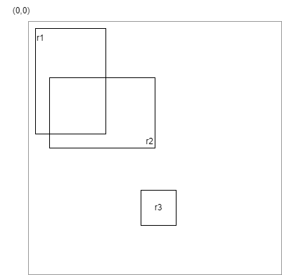

# Drones
## Interface

L'espace aérien est ouvert à tout types de drones. Il va donc y avoir potentiellement des dizaines de drones de marques et modèles différents, avec des caractéristiques différentes.

Cela ne pose aucun problème, mais il est nécessaire que tous respectent certaines consignes de sécurité communes.

C'est dans ce but que l'interface `IExpellable` a été conçue. Cette interface définit les commandes (=méthodes) dont un centre de contrôle a besoin pour gérer une zone d'exclusion, c'est-à-dire une zone dans laquelle aucun drone ne doit voler.

```csharp
public enum EvacuationState 
{
    Free,           // No limits applied
    Evacuating,     // Limits known, moving out of the zone
    Evacuated       // Limits known, out of the zone
}

public interface IExpellable
{
    // Signal the limits of the no-fly zone 
    // Return true if the drone is already outside the zone
    public bool Evacuate (Rectangle zone);

    // Terminate the no-fly zone
    public void FreeFlight();

    // Interrogate the drone
    public EvacuationState GetEvacuationState();
}
```

## Travail à effectuer

1. Créer l'interface `IExpellable` dans votre projet Drone 
2. Déclarer le fait que la classe Drone implémente cette interface
3. Générer les méthodes de l'interface avec Visual Studio (Actions rapides > Implémenter l'interface), vérifier que le code compile
4. Faire un commit
5. Ajouter le test ci-dessous dans votre classe de test. Exécuter les tests: ce test doit s'exécuter mais échouer (normal, on n'a encore rien codé)
6. Modifiez votre classe `Drone` (partie modèle) jusqu'à ce que le test réussisse
7. Faire un commit

```csharp
[TestMethod]
public void Test_that_drone_is_taking_orders()
{
    // Arrange
    Drone drone = new Drone(500, 500);

    // Act
    EvacuationState state = drone.GetEvacuationState();

    // Assert
    Assert.AreEqual(EvacuationState.Free, state);

    // Arrange a no-fly zone around the drone
    bool response = drone.Evacuate(new System.Drawing.Rectangle(400,400,200,200));

    // Assert
    Assert.IsFalse(response); // because the zone is around the drone
    Assert.AreEqual(EvacuationState.Evacuating, drone.GetEvacuationState());

    // Arrange: remove no-fly zone
    drone.FreeFlight();

    // Assert
    Assert.AreEqual(EvacuationState.Free, drone.GetEvacuationState());
}

```

**Bon à savoir:** .NET permet de savoir facilement si deux rectangles se touchent:  


```csharp
Rectangle r1 = new Rectangle(10,10,100,150);
Rectangle r2 = new Rectangle(30,100,150,100);
Rectangle r3 = new Rectangle(200,300,50,50);

r1.IntersectsWith(r2); // true
r1.IntersectsWith(r3); // false
